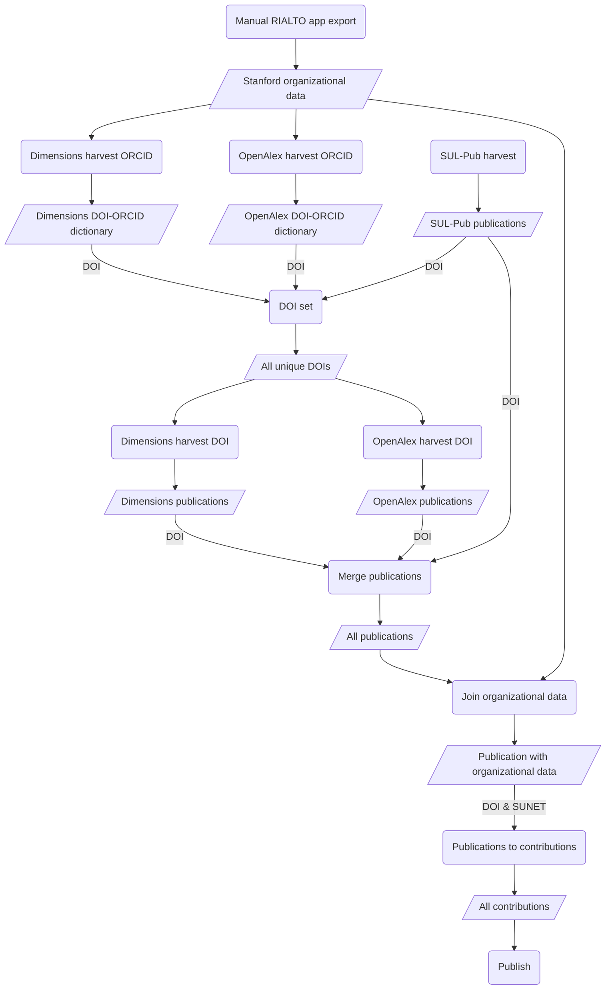

# rialto-airflow

[](https://github.com/sul-dlss-labs/rialto-airflow/actions/workflows/test.yml)

Airflow for harvesting data for open access analysis and research intelligence. The workflow integrates data from [sul_pub](https://github.com/sul-dlss/sul_pub), [rialto-orgs](https://github.com/sul-dlss/rialto-orgs), [OpenAlex](https://openalex.org/) and [Dimensions](https://www.dimensions.ai/) APIs to provide a view of publication data for Stanford University research. The basic workflow is: fetch Stanford Research publications from SUL-Pub, OpenAlex, and Dimensions, enrich them with additional metadata from OpenAlex and Dimensions using the DOI, merge the organizational data found in [rialto_orgs], and publish the data to our JupyterHub environment.



## Running Locally with Docker

Based on the documentation, [Running Airflow in Docker](https://airflow.apache.org/docs/apache-airflow/stable/start/docker.html).

1. Clone repository `git clone https://github.com/sul-dlss/rialto-airflow.git`

2. Start up docker locally.

3. Create a `.env` file with the `AIRFLOW_UID` and `AIRFLOW_GROUP` values. For local development these can usually be:
```
AIRFLOW_UID=50000
AIRFLOW_GROUP=0
AIRFLOW_VAR_DATA_DIR="data"
```
(See [Airflow docs](https://airflow.apache.org/docs/apache-airflow/2.9.2/howto/docker-compose/index.html#setting-the-right-airflow-user) for more info.)

4. Add to the `.env` values for any environment variables used by DAGs. Not in place yet--they will usually applied to VMs by puppet once productionized.

Here is an script to generate content for your dev .env file:

```
for i in `vault kv list -format yaml puppet/application/rialto-airflow/dev | sed 's/- //'` ; do \
  val=$(echo $i| tr '[a-z]' '[A-Z]'); \
  echo AIRFLOW_VAR_$val=`vault kv get -field=content puppet/application/rialto-airflow/dev/$i`; \
done
```

5. The harvest DAG requires a CSV file of authors from rialto-orgs to be available. This is not yet automatically available, so to set up locally, download the file at
https://sul-rialto-dev.stanford.edu/authors?action=index&commit=Search&controller=authors&format=csv&orcid_filter=&q=. Put the `authors.csv` file in the `data/` directory. 

## Development

### Set-up

1. Install `uv` for dependency management as described in [the uv docs](https://github.com/astral-sh/uv?tab=readme-ov-file#getting-started).
2. Create a virtual environment:
```
uv venv
```

This will create the virtual environment at the default location of `.venv/`. `uv` automatically looks for a venv at this location when installing dependencies.

3. Activate the virtual environment:
```
source .venv/bin/activate
```


### Install dependencies
```
uv pip install -r requirements.txt
```

To add a dependency:
1. `uv pip install flask`
2. Add the dependency to `pyproject.toml`.
3. To re-generate the locked dependencies in `requirements.txt`:
```
uv pip compile pyproject.toml -o requirements.txt
```

Unlike poetry, uv's dependency resolution is not platform-agnostic. If we find we need to generate a requirements.txt for linux, we can use [uv's multi-platform resolution options](https://github.com/astral-sh/uv?tab=readme-ov-file#multi-platform-resolution).

## Run Tests

First enable the virtual environment:

```
source .venv/bin/activate
```

Then ensure the app dependencies and dev dependencies are installed.

```
uv pip install -r requirements.txt -r requirements-dev.txt
```

Then run the tests:

```
pytest
```

### Linting and formatting

1. Run linting: `ruff check`
2. Automatically fix linting: `ruff check --fix`
3. Run formatting: `ruff format` (or `ruff format --check` to identify any unformatted files)

## Deployment

First you'll need to build a Docker image and publish it DockerHub:

```
DOCKER_DEFAULT_PLATFORM="linux/amd64" docker build . -t suldlss/rialto-airflow:latest
docker push suldlss/rialto-airflow
```

Deployment to https://sul-rialto-airflow-dev.stanford.edu/ is handled like other SDR services using Capistrano. You'll need to have Ruby installed and then:

```
bundle exec cap dev deploy
```
